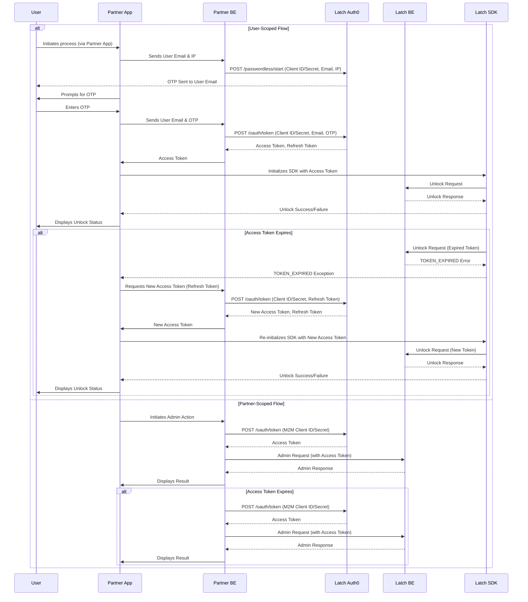

# Partner Backend

Latch will provide Partners with a unique [Auth0 app](https://auth0.com/docs/get-started/applications).
This page covers what your [client ID and secret](#1-client-id-and-client-secret) are for, [partner and user scoped tokens](#2-authorization-token), [token generation](#3-authorization-token-generation), [token expiration](#4-token-expiration), and refresh [token generation](#5-refresh-token).

> [!NOTE]
> You can find a diagram for this process [here](#6-sequence-diagram)

# 1. Client ID and Client Secret
These are unique values provided by Latch to the Partner through secure and encrypted channels. It is the Partner’s responsibility to securely store the Client Id and Client Secret so that it is only used when communicating with the Latch Auth0 app.
You will receive your partner credentials (ID and Secret) after you have completed the partner onboarding.

There will be **2 sets** of Client Id and Client Secret, each one for different use cases:
1. **User-scoped credentials (passwordless)**
   * These credentials are used to create **user-scoped tokens** and then use that token to make calls from the SDK.
   * In this documentation, we'll refer to them as `{{passwordless_client_id}}` and `{{passwordless_client_secret}}`.
2. **Partner-scoped credentials (machine-to-machine)**
   * These credentials are used to create **partner-scoped tokens** and then use that token to make calls for non-user related actions (e.g. creating users and granting access).
   * In this documentation, we'll refer to them as `{{m2m_client_id}}` and `{{m2m_client_secret}}`.
   * **Note:** These credentials are also used to generate the user tokens, which are expected to be replaced by passwordless tokens.

In both cases, these credentials are only to be used from the Partner Backend. To create partner or user scoped tokens see the [Authorization Token](#2-authorization-token) section below.
Latch reserves the right to rotate the Client Secret in the future and will coordinate with the partner to update it.

# 2. Authorization Token

All the interactions between the Partner BE or Partner app and Latch BE must contain a [JWT token](https://auth0.com/docs/secure/tokens/json-web-tokens) that represents the partner and the scope of permissions. There are 2 type of tokens:

* User-scoped
* Partner-scoped

Depending on the API used and whether the API call is done on behalf of the user or not, the partner should use the corresponding token.

The Partner BE will be responsible for communicating to the Latch-provided Auth0 service to retrieve an authorization token. This token will need to be passed down through the Partner App to the Latch SDK. 

### 2.1 User-scoped Tokens

**These tokens allow partners to make API calls on behalf of an end-user.**

To unlock a Latch device using a Partner App, the Partner App first needs to get permission. It does this by sending the **user's email** address, along with your **client ID** and **secret key**, to Latch's system (Auth0).

However, this only works if the user is already **registered with Latch**, **connected to that specific Partner**, and has been **given permission** (by either the Partner or Latch) to unlock the particular Latch device (door). The email address provided by the Partner App must match the email address of this pre-registered user. If all these conditions are met, Latch's system will grant the Partner App the necessary permission (a token) to unlock the device.

After the Partner App sends the user's email, client ID, and secret key to Latch, Latch's system checks if the user is indeed connected to that Partner.  If they are, Latch's system creates a digital key (a JWT token, including both the User ID and Partner ID as [claims](https://auth0.com/docs/secure/tokens/json-web-tokens/json-web-token-claims)) that proves the Partner App has permission to act on behalf of that specific user and for that specific Partner.

> [!IMPORTANT]
> Importantly, **the Partner App never needs to send the user's Latch password**.  Latch's Auth0 app doesn't require it for this authorization process. The Partner App should not collect or transmit the user's Latch password.

### 2.2 Partner-scoped Tokens

**These tokens can be used to make API calls that are not operating on behalf of the end-user.**

For operations not tied to a specific end-user, Partners can obtain a **Partner-scoped** token. The Partner's backend authenticates itself with the Latch Auth0 application by providing its `Client ID` and `Client Secret`. Crucially, _no user email is included_ in this request. The Auth0 application then issues a JWT (JSON Web Token) where the Partner's ID is included as a claim. This JWT grants the Partner the ability to make API calls scoped solely to their organization. Each generated token is specific to a single Partner. This allows Partners to perform administrative or management tasks without needing to act on behalf of an individual user (e.g. getting a list of doors or properties).

# 3. Authorization Token Generation

## 3.1 User-scoped tokens
As part of the authorization request, the user will need to be identified through an **email based verification code**. 

To obtain a token from the Latch Auth0 App, the following steps need to be executed:
1. [Get user information](#1-get-user-information)
2. [Start the passwordless flow](#2-start-the-passwordless-flow)
3. [Latch sends OTP to user's email](#3-latch-sends-otp)
4. [User inputs OTP in the Partner UI](#4-user-inputs-otp-in-the-partner-ui)
5. [Partner sends user + OTP to Latch](#5-partner-sends-user-and-otp-to-latch)

### 1. Get user information
Partner App obtains the IP (IPv4) address from the Device and the email of the logged in User and sends that to the Partner BE.

### 2. Start the passwordless flow
The Partner BE sends a POST request to the Latch Auth0 App for that specific user.
#### Endpoint
```http
POST https://auth.prod.latch.com/passwordless/start
```
#### HTTP Request Headers

```http
auth0-forwarded-for: {{user_ip}}
```
#### HTTP Request Body
```http
{
    "client_id": "{{passwordless_client_id}}",
    "client_secret": "{{passwordless_client_secret}}",
    "email": "{{user_email}}",
    "connection": "email",
    "send": "code"
}
```
#### HTTP Response Body
```http
{
    "email": "<string>",
    "email_verified": <bool>,
    "_id": "<string>",
}
```
### 3. Latch sends OTP
#### Response
If the Request is successful, Latch Auth0 app, will send a Verification Code (OTP) to the user’s email and return an HTTP 200 with the following fields:
* `email`: User email (same as the email provided in the HTTP request).
* `email_verified`: Unused field.
* `_id`: Unused field.

#### Errors
In case of an error, the API will return the following HTTP error codes and detailed information in the `error_description` field:

**HTTP 400**
* `error="bad.email"`: Missing `email` parameter. ⇒ Check the API request to make sure all fields have been populated.
* `error="extensibility_error" error_description="UNAUTHORIZED"`: Email account is not authorized or doesn't exist. ⇒ Check if the email has been configured in Mission Control or programmatically via User Kit API.
* `error="extensibility_error" error_description="USER_ACCOUNT_NOT_ACTIVE"`: Email account exists, but is not active. ⇒ Contact Latch Support to check the status of the user account.

**HTTP 403**
* `error="unauthorized_client"`: missing or invalid credentials. ⇒ Check the request is using the correct value for `client_id` and `client_secret`.

**HTTP 500**
* `error="internal_server_error"`: There was an unexpected error. ⇒ Contact Latch Support to help debug this issue.

### 4. User inputs OTP in the Partner UI
The Partner App will need to provide UI for the user to input the Verification Code from the user’s email.

### 5. Partner sends user and OTP to Latch
The Partner App will need to send the User email address and the Verification Code to the Partner BE. Then, the partner BE makes a POST to the Latch Auth0 App with the following:
#### Endpoint
```http
POST https://auth.prod.latch.com/v1/oauth/token
```
#### HTTP Request Body
```http
{
    "client_id": "{{passwordless_client_id}}",
    "client_secret": "{{passwordless_client_secret}}",
    "otp": "{{verification_code}}", 
    "username": "{{user_email}}", 
    "audience": "https://rest.latchaccess.com/access/sdk", 
    "grant_type": "http://auth0.com/oauth/grant-type/passwordless/otp", 
    "realm": "email", 
    "scope": "openid profile email offline_access"
}
```
#### Response
```http
{
    "access_token": "<string>",
    "refresh_token": "<string>",
    "expires_in": <int>,
    "token_type": "Bearer",
    "scope": "openid profile email offline_access",
    "id_token": "<string>"
}
```
#### Response fields description
If the request was successful, an HTTP 200 will be returned with the following fields:
* `access_token`: User-scoped access token the Partner BE should send to the Partner App so it can initialize the SDK.
* `refresh_token`: Refresh token the Partner BE should store to use later during the token refresh flow, once the Access token expires.
* `expires_in`: Time-to-live of the access token, in seconds. After this amount of time, the given access token will no longer be valid.
* `token_type`: Auth scheme to use (will always be "Bearer").
* `scope`: List of scopes included in the token (same as the value provided in the HTTP request.
* `id_token`: Unused field.
#### Errors
In case of an error, the API will return the following HTTP error codes and detailed information in the `error_description` field:

**HTTP 400**
* `error="invalid_request"`: Missing or invalid parameter. ⇒ Check the API request to make sure all fields have been populated. More details about the error in the `error_description` field.

**HTTP 401**
* `error="access_denied"`: missing or invalid credentials. ⇒ Check the request is using the correct value for `client_id` and `client_secret`.

**HTTP 403**
* `"error": "invalid_grant"`: Missing or invalid grant parameters. ⇒ Check the API request to make sure the `username`, `otp`, `audience`, and `scope` fields have the right values.
* `"error": "unauthorized_client"`: Missing or invalid grant type. ⇒ Check the API request to make sure the `grant_type` field has the right value.

**HTTP 500**
* `error="internal_server_error"`: There was an unexpected error. ⇒ Contact Latch Support to help debug this issue.


## 3.2 Partner-scoped tokens
To request a token from the Latch Auth0 application, the Partner's backend system (BE) will send an HTTP POST request to the Latch Auth0 application's endpoint.
#### Endpoint
```http
POST https://auth.prod.latch.com/v1/oauth/token
```
#### HTTP Request Body
```http
{
    "client_id": "{{m2m_client_id}}",
    "client_secret": "{{m2m_client_secret}}",
    "audience": "https://rest.latchaccess.com/access/sdk", 
    "grant_type": "client_credentials", 
}
```
#### HTTP Response Body
```http
{
    "access_token": "<string>",
    "expires_in": <int>,
    "token_type": "Bearer"
}
```
#### Response
If the request was successful, an HTTP 200 will be returned with the following fields:
* `access_token`: Partner-scoped access token the Partner BE should store to use in all future API requests.
* `expires_in`: Time-to-live of the access token, in seconds. After this amount of time, the given access token will no longer be valid.
* `token_type`: Auth scheme to use (will always be "Bearer").
#### Errors
In case of an error, the API will return the following error codes:
**HTTP 400**
* `error="invalid_request"`: missing required parameters. ⇒ Check the request includes the `grant_type` parameter.
**HTTP 401**
* `error="access_denied"`: missing or invalid credentials. ⇒ Check the request is using the correct value for `client_id` and `client_secret`.
**HTTP 403**
* `error="access_denied"`: missing or invalid `audience` parameter. ⇒ Check the API request to make sure the `audience` field has the right value.
**HTTP 500**
* `error="internal_server_error"`: there was an unexpected error. ⇒ Contact Latch Support to help debug this issue.

# 4. Token Expiration

### 4.1 Expiration of User-scoped tokens
The JWT tokens issued by the Latch Authentication service to the Partner's backend are valid for 24 hours. If the Partner's application attempts to use an expired token with the Latch SDK, the SDK will raise a `TOKEN_EXPIRED` exception.
The Partner App is responsible for handling this exception. Upon receiving this exception, the Partner App should initiate the process of obtaining a **new token** from the Partner's backend and the Latch Auth0 service.

To minimize delays for the user and improve performance, the Partner application should proactively request a new token before the current one expires.  This prevents the user from having to wait for a new token to be fetched when they try to use the app.

> [!NOTE]
> It's important to note that even if the Auth Token expires, a user can still unlock a door using a Bluetooth Low Energy (BLE) credential.  **The expiration of the Auth Token does not affect BLE credential functionality.**

### 4.2 Expiration of Partner-scoped tokens

The JWT token provided to the Partner BE from the Latch Authentication service will expire within 24 hours. Invoking OpenKit APIs with an expired token will return a `403 Forbidden HTTP` error and the Partner backend should initiate the token authorization flow again (as described above).

# 5. Refresh Token 

<table>
<tr><td></td></tr>
</table>

Refresh Tokens are used to avoid repeatedly requiring user verification and are a required implementation for both the Partner App and its backend.  When the Latch SDK makes a request using an expired Access Token, the Latch backend will return an error.  The Partner App should intercept this error and use it as a trigger to initiate the Refresh Token flow to obtain a new, valid Access Token.

## 5.1 Requesting a new token
#### Endpoint
```http
POST https://auth.prod.latch.com/v1/oauth/token
```
#### HTTP Request Body
```http
{
  "client_id": "{{passwordless_client_id}}",
  "client_secret": "{{passwordless_client_secret}}",
  "audience": "https://rest.latchaccess.com/access/sdk",
  "grant_type": "refresh_token",
  "refresh_token": "string",
}
```

#### HTTP Response Body
	
```http
{
    "access_token": "<string>",
    "refresh_token": "<string>",
    "expires_in": <int>,
    "token_type": "Bearer",
    "scope": "openid profile email offline_access",
    "id_token": "<string>"
}
```
#### Response
If the request was successful, an HTTP 200 will be returned with the following fields (same as the request to obtain a new Auth token, as described above):
* `access_token`: User-scoped access token the Partner BE should send to the Partner App so it can initialize the SDK.
* `refresh_token`: Refresh token the Partner BE should store to use later during the token refresh flow, once the Access token expires.
* `expires_in`: Time-to-live of the access token, in seconds. After this amount of time, the given access token will no longer be valid.
* `token_type`: Auth scheme to use (will always be "Bearer").
* `scope`: List of scopes included in the token (same as the value provided in the HTTP request.
* `id_token`: Unused field.

In case of an error, the API will return the following error codes:

**HTTP 400**
* `error="invalid_request"`: missing required parameters. ⇒ Check the request includes both `grant_type` and `refresh_token` parameters.

**HTTP 401**
* `error="access_denied"`: missing or invalid credentials. ⇒ Check the request is using the correct value for `client_id` and `client_secret`.

**HTTP 403**
* `"error": "invalid_grant"`: Missing or invalid grant parameters. ⇒ Check the API request to make sure the `refresh_token` field has the right value.
* `"error": "unauthorized_client"`: Grant type not allowed for the client. ⇒ Check the API request to make sure the `grant_type` field has the right value.

**HTTP 500**
* `error="internal_server_error"`: there was an unexpected error. ⇒ Contact Latch Support to help debug this issue.
> [!IMPORTANT]
> The Partner App will need to re-initialize the Latch SDK with the new Access Token.

# 6. Sequence diagram

