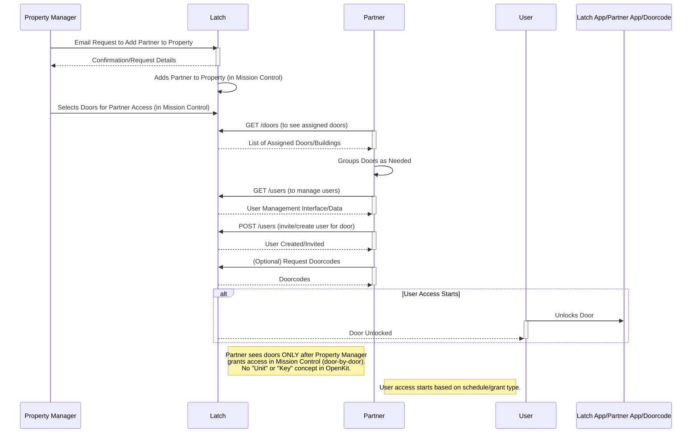
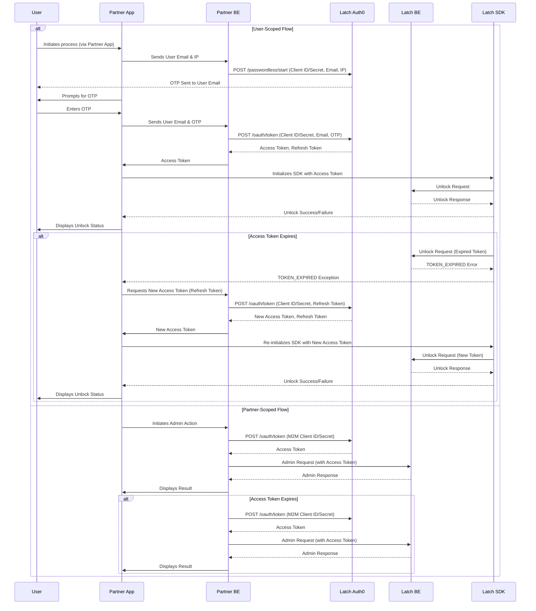
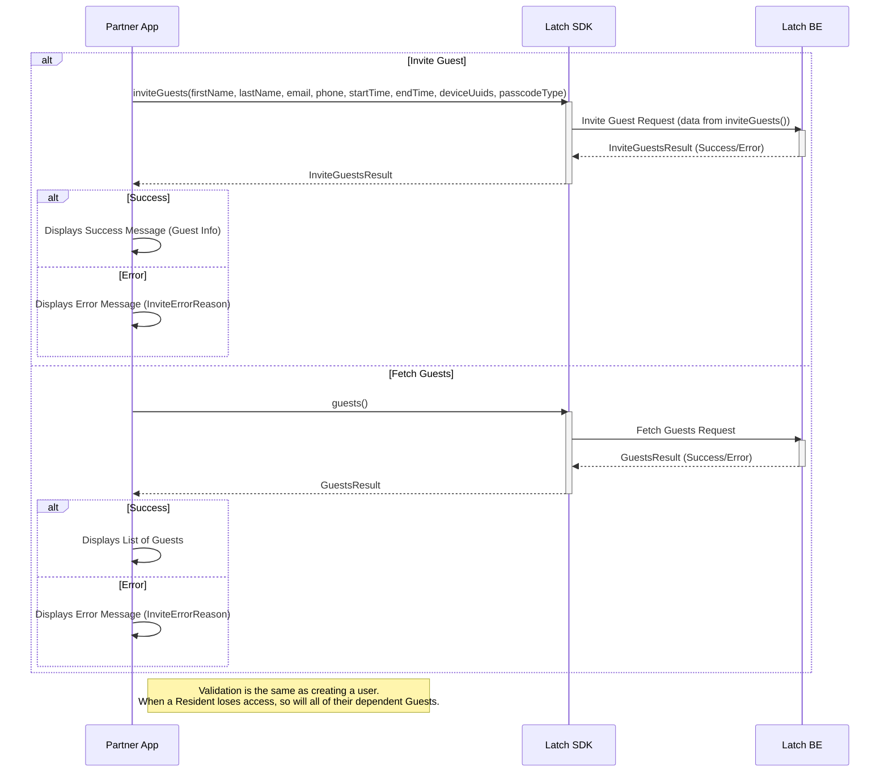

# System Flow
1. [Door/Property Setup](#door-property-setup)
2. [Partner Backend](#authentication-for-sdk)
3. [Invite guests](#inviting-guests)

## Door/Property Setup

## Authentication for SDK

## Inviting guests

